# 📈 StockLearn — Project Samridhha

<div align="center">

**Financial Literacy & Spike Detection App for Nepal's Stock Market**

*From confusion to clarity to confidence*


</div>

---

## 🧭 What is StockLearn?

StockLearn is a beginner-friendly mobile app that helps Nepali investors, especially youth and women, learn stock market fundamentals and stay aware of unusual market activity. Built around Nepal's NEPSE market context, it pairs **structured microlearning** with an **AI-powered spike detection alert system**, so users can learn, track, and act from one place.

> **Community research in Ward 16** found that while many people are interested in investing, they are overwhelmed by complex tools, lack guidance, and do not have time to monitor the market constantly. StockLearn was built to directly address these gaps.

---

## ✨ Key Features

| Feature | Description |
|---|---|
| 📚 Microlearning Module | Short, structured lessons with quizzes and progress tracking |
| 🏆 Gamification | XP, streaks, badges, hearts, and levels to keep learning engaging |
| 📊 Market Dashboard | Personalized hub showing learning progress, watchlist, and alerts |
| 🔍 Browse Market | Search NEPSE stocks, view gainers, losers, and sector allocation |
| 🔔 Smart Alert System | Set price or volume thresholds and get notified on unusual market activity |
| 📰 News & Research | Curated NEPSE updates and regulator bulletins |
| 🔐 Auth | JWT-based auth with Google OAuth sign-in |
| 🛠 Admin Console | Manage lessons, users, and content through admin APIs |

---

## 🏗 Project Structure

```text
Project-Samridhha/
├── StockLaern/        # Mobile app (Expo / React Native / TypeScript)
├── backend-nest/      # Main backend API (NestJS + MongoDB)
├── Data-Server/       # Market simulation + WebSocket server (Flask + Python)
├── photos/            # App screenshots used in this README
└── Data/              # CSV datasets — NEPSE company and price history
```

> **Note:** The `StockLaern` folder name is intentionally kept as-is to match the current project setup.

---

## 🔧 Tech Stack

### Frontend (`StockLaern/`)

- **React Native** with **Expo** for cross-platform mobile development
- **TypeScript** for a type-safe and maintainable codebase
- Tab-based navigation, global auth state, and responsive layouts
- Designed in **Figma** with a beginner-first UX approach

### Backend (`backend-nest/`)

- **NestJS** for a modular and scalable Node.js backend
- **MongoDB + Mongoose** for data persistence
- **JWT Authentication** with role-based access control
- REST APIs for auth, lessons, progress, alerts, watchlist, news, and dashboard features

### Data Server (`Data-Server/`)

- **Flask + Socket.IO** for REST and WebSocket endpoints
- **Pandas + NumPy** for data processing and spike analysis
- NEPSE-style real-time market simulation engine
- Rule-based spike detection designed to be swapped with a live NEPSE data source later

---

## ⚙️ Prerequisites

Make sure you have the following installed before running the project:

| Tool | Version |
|---|---|
| Node.js | v18+ recommended |
| Python | 3.9+ |
| MongoDB | Local instance or MongoDB Atlas |
| npm | v9+ |
| Expo CLI | Optional if you prefer the global CLI workflow |

---

## 🚀 Quick Start

### 1. Data Server (Flask — default port `4000`)

```bash
cd Data-Server
python -m venv .venv

# Windows:
.venv\Scripts\activate

# macOS/Linux:
source .venv/bin/activate

pip install -r requirements.txt
python run.py
```

### 2. Backend API (NestJS — default port `3000`)

```bash
cd backend-nest
cp .env.example .env
npm install
npm run start:dev
```

### 3. Mobile App (Expo)

```bash
cd StockLaern
npm install
npm start
```

Then scan the QR code with **Expo Go** on your phone or run the app on an emulator.

---

## 🔑 Environment Variables

Create `.env` files inside both `backend-nest/` and `Data-Server/` using the provided example files.

**`backend-nest/.env`**

```env
MONGO_URI=mongodb://localhost:27017/project-samridhha
JWT_SECRET=replace-with-strong-secret
ADMIN_BOOTSTRAP_KEY=replace-with-one-time-bootstrap-key

GOOGLE_CLIENT_ID=your-google-client-id.apps.googleusercontent.com
GOOGLE_SECRET=your-google-client-secret
GOOGLE_CALLBACK_URL=https://your-ngrok-subdomain.ngrok-free.dev/auth/google/callback

MOBILE_REDIRECT_URI=stocklearn://auth
WEB_REDIRECT_URI=http://localhost:8081/auth

DATA_SERVER_URL=http://localhost:4000
PORT=3000
```

**`Data-Server/.env`**

```env
PORT=4000
HOST=0.0.0.0
TICK_INTERVAL_SECONDS=5
DATA_PROVIDER=simulator
CORS_ORIGIN=*
DEBUG=true
FORCE_MARKET_OPEN=true
```

---

## 🌱 Seeding Lesson Content

The main curriculum file is:
`backend-nest/seed/lessons.nepal-finlit-curriculum.json`

```bash
cd backend-nest

# Preview what will be seeded (no DB writes)
node seed/run-lesson-seed.js --dry-run

# Run the seed
node seed/run-lesson-seed.js

# Other useful options
node seed/run-lesson-seed.js --help
node seed/run-lesson-seed.js --mode replace-all
node seed/run-lesson-seed.js --mode replace-module --module "Money 101"
node seed/run-lesson-seed.js --file seed/lessons.nepal-finlit-curriculum.json
```

---

## 🧠 How the Spike Detection Works

Rather than relying solely on ML models, the alert system uses a **rule-based detection engine**:

1. The user sets a threshold, such as a volume spike above 150% of average or a price jump above 3%.
2. The data server continuously simulates NEPSE-style price and volume ticks.
3. When a threshold is crossed, an alert is triggered and pushed to the user.
4. Alert types include **Volume Spike Alert** and **Price Jump Alert**.

The simulation engine uses historical NEPSE data to produce realistic tick behavior and is structured so it can later be swapped with a live NEPSE API.

---

## 📱 App Screenshots

All screenshots below are loaded from the [`photos`](./photos) folder and displayed at a consistent size for a cleaner project gallery.

### Authentication & Entry

<table>
  <tr>
    <td align="center">
      <strong>Login</strong><br />
      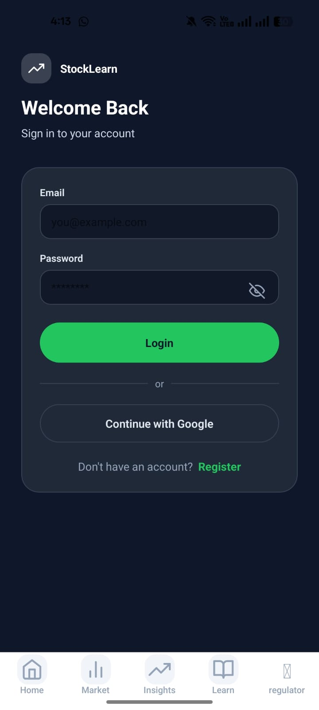
    </td>
    <td align="center">
      <strong>Sign Up</strong><br />
      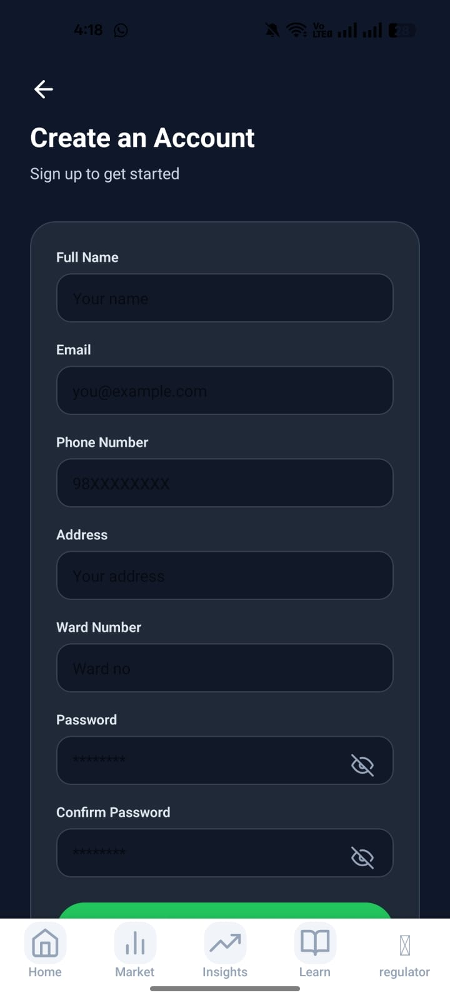
    </td>
    <td align="center">
      <strong>Guest Dashboard</strong><br />
      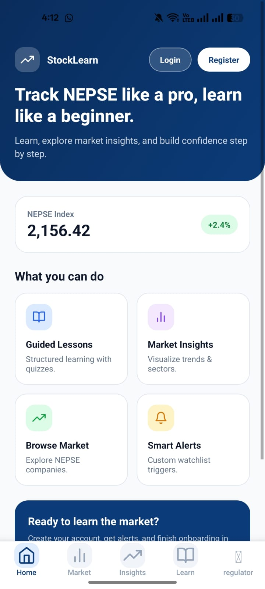
    </td>
  </tr>
</table>

### Dashboard Experience

<table>
  <tr>
    <td align="center">
      <strong>Dashboard Overview</strong><br />
      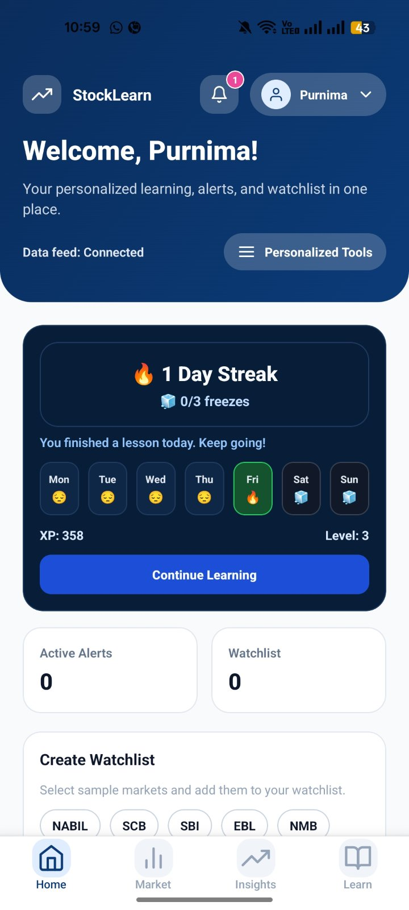
    </td>
    <td align="center">
      <strong>Dashboard Screen 2</strong><br />
      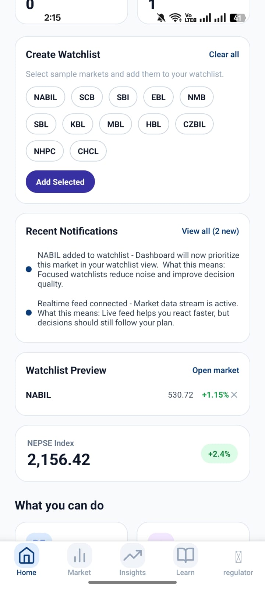
    </td>
    <td align="center">
      <strong>Dashboard Screen 3</strong><br />
      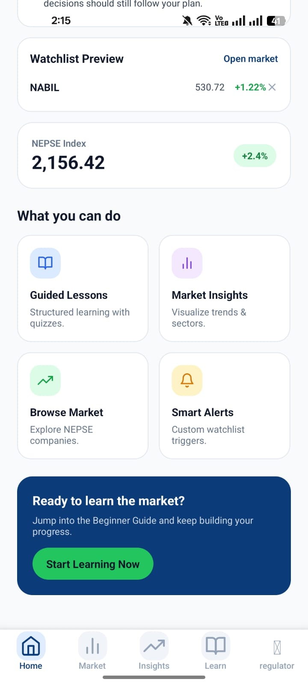
    </td>
  </tr>
</table>

### Learning & Rewards

<table>
  <tr>
    <td align="center">
      <strong>Learning Tab</strong><br />
      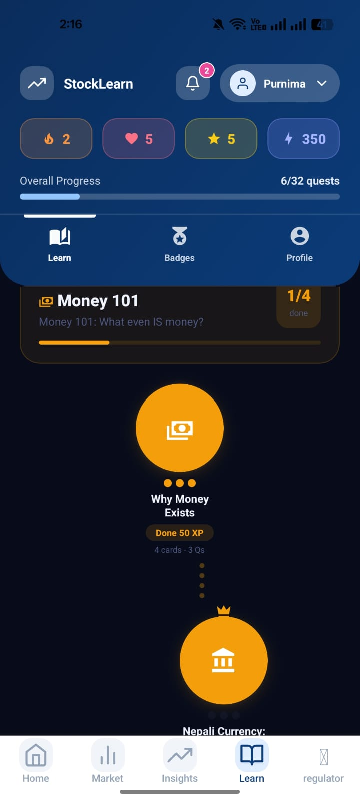
    </td>
    <td align="center">
      <strong>Lesson Progress</strong><br />
      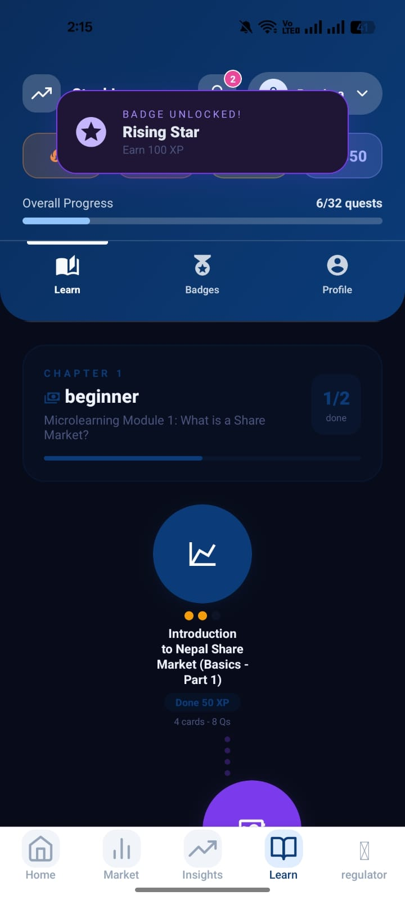
    </td>
    <td align="center">
      <strong>Badges & Achievements</strong><br />
      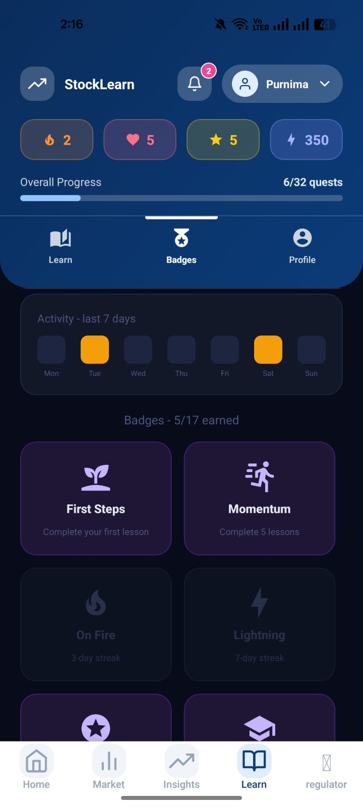
    </td>
  </tr>
</table>

### Market & Alerts

<table>
  <tr>
    <td align="center">
      <strong>Market View</strong><br />
      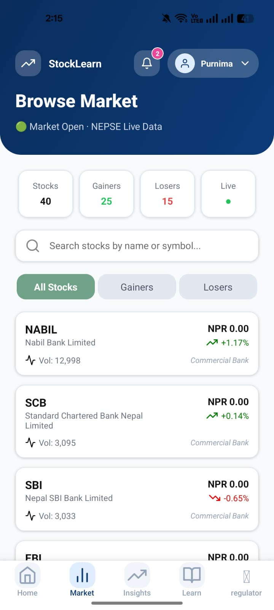
    </td>
    <td align="center">
      <strong>Insights</strong><br />
      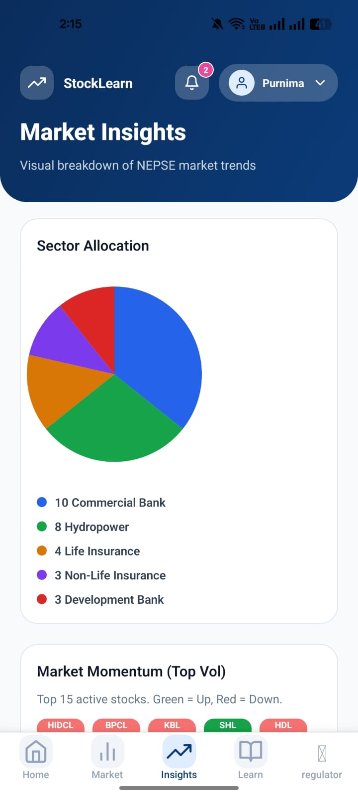
    </td>
    <td align="center">
      <strong>Smart Alerts</strong><br />
      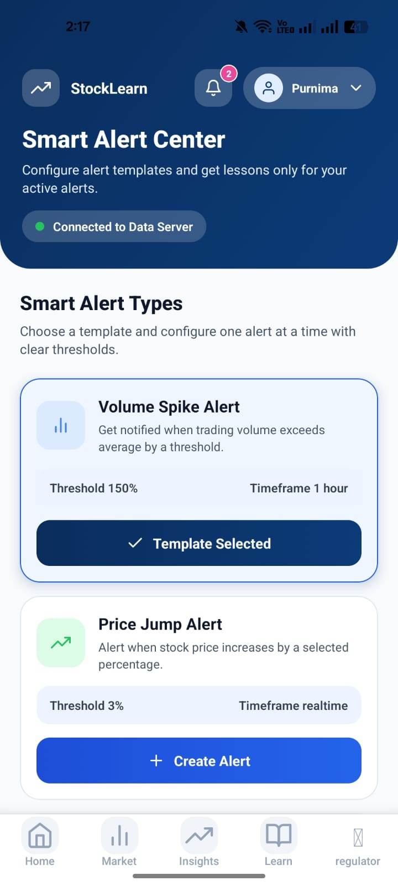
    </td>
  </tr>
</table>

### News & Notifications

<table>
  <tr>
    <td align="center">
      <strong>News Feed</strong><br />
      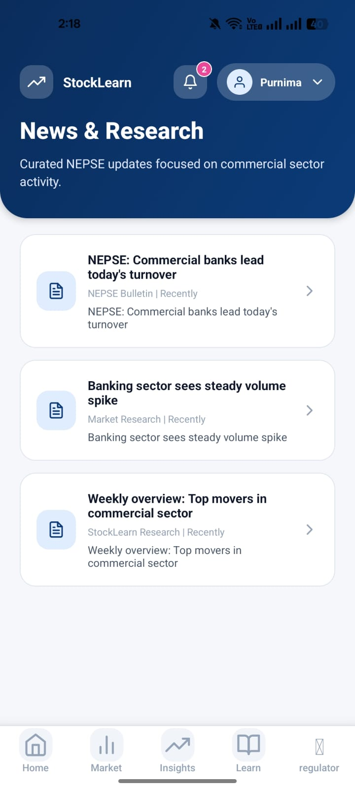
    </td>
    <td align="center">
      <strong>Notifications</strong><br />
      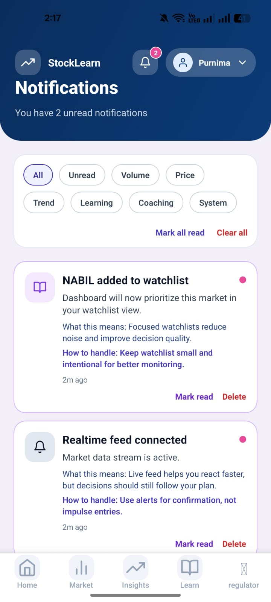
    </td>
  </tr>
</table>

### Profile

<table>
  <tr>
    <td align="center">
      <strong>Profile Home</strong><br />
      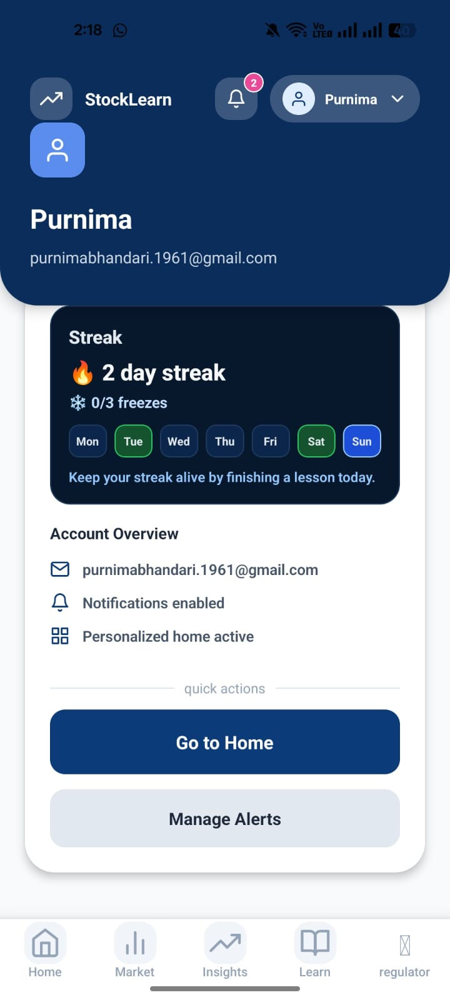
    </td>
    <td align="center">
      <strong>Profile Details</strong><br />
      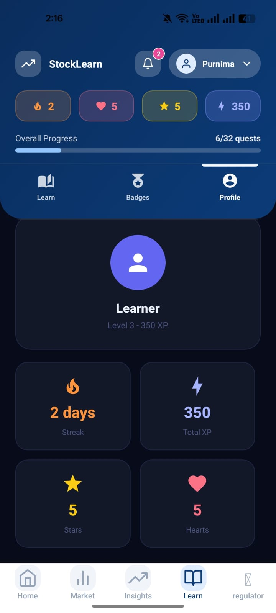
    </td>
  </tr>
</table>

---

## 👥 Team Samridhha

- **Kanchi Tamang**
- **Purnima Bhandari**
- **Manasi Acharya**

---

## 🔮 Future Roadmap

- [ ] Live NEPSE API integration to replace the simulation engine
- [ ] AI-powered personalized investment insights
- [ ] Voice-activated learning assistant
- [ ] Community discussion forum
- [ ] Personalized lesson path recommendations

---

## 🙏 Acknowledgements

Built as part of the **TechLeadHers Fellowship 2025/26** by Aaviyanta Foundation. Special thanks to Agma Malakar, Sangam Uprety, Akash Rai, Ichhita Bajracharya, and Prenisha Upreti for their continued guidance.

---

<div align="center">

*StockLearn — empowering Nepal's next generation of informed investors.*

</div>
